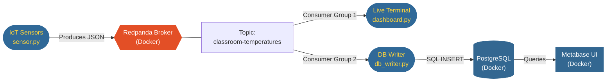

# Decoupled IoT Event Streaming Architecture

[](https://youtu.be/w3ypnW0UWHc)

## Overview
This capstone project demonstrates an enterprise-grade, event-driven architecture designed to solve a common IoT challenge: point-to-point data silos. By placing a Redpanda event broker at the center of the infrastructure, edge sensors are completely decoupled from downstream data consumers, allowing for infinite horizontal scalability and zero data loss during database maintenance.

Built with pre-sales engineering in mind, this project emphasizes **business value through technical architecture**, showcasing secure fan-out patterns, containerized orchestration, and real-time data visualization.

## Architecture & Data Flow



## Key Technical Features

* **Complete Decoupling:** Producers and consumers operate entirely independently. Downstream database outages do not impact edge sensor data collection.
* **The Fan-Out Pattern:** A single stream of telemetry data is consumed by multiple independent consumer groups simultaneously (Terminal Dashboard & PostgreSQL).
* **Enterprise Security:** The Redpanda cluster is secured using SASL/SCRAM authentication. Python clients authenticate via explicit Access Control Lists (ACLs) scoped strictly to the `classroom-temperatures` topic.
* **Infrastructure as Code:** The entire data stack (Message Broker, Relational Database, and BI Tool) is orchestrated via a single `docker-compose.yml` file using internal Docker networking.

## Tech Stack

* **Event Streaming:** Redpanda (Kafka-compatible)
* **Languages:** Python (confluent-kafka, psycopg2)
* **Storage:** PostgreSQL 15
* **Visualization:** Metabase
* **Orchestration:** Docker Compose

---

## Quick Start Guide

### 1. Spin up the infrastructure
Ensure Docker Desktop is running, then launch the cluster:
```bash
docker compose up -d
```
*Note: Metabase may take 1-2 minutes to initialize on port 3000.*

### 2. Install Python dependencies
```bash
pip install confluent-kafka psycopg2-binary
```

### 3. Run the pipeline
Open three separate terminal windows to watch the decoupled fan-out happen in real-time.

**Terminal 1: Start the downstream database writer**
```bash
python db_writer.py
```

**Terminal 2: Start the downstream live dashboard**
```bash
python dashboard.py
```

**Terminal 3: Start the upstream edge sensors**
```bash
python sensor.py
```

### 4. Visualize the data
1. Navigate to `http://localhost:3000` to access Metabase.
2. Connect to the `postgres` Docker service.
3. Build a line chart grouping `Average Temperature` by `Classroom` over `Recorded At (Minute)`.
